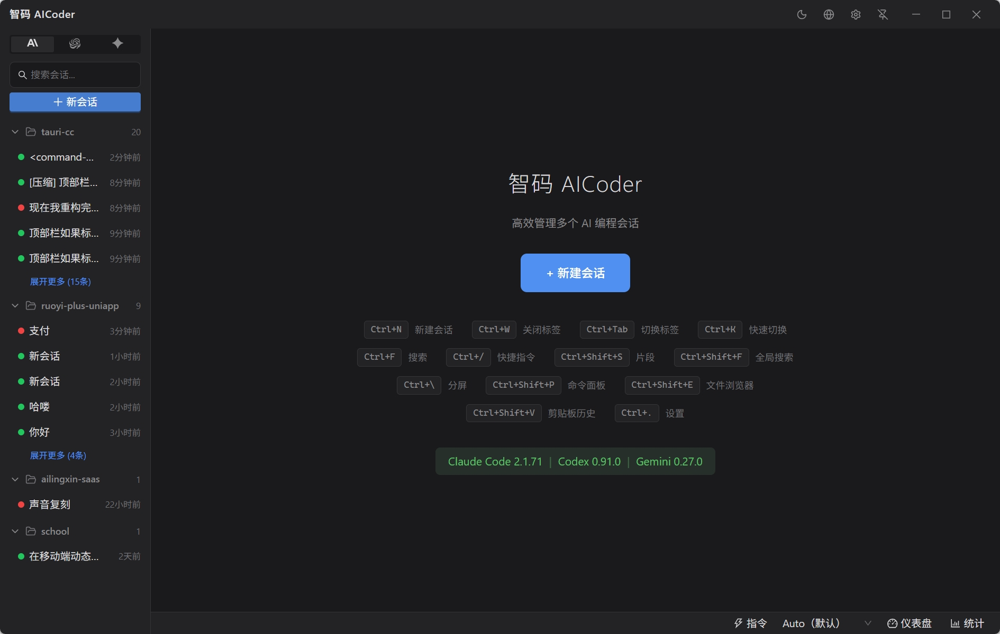
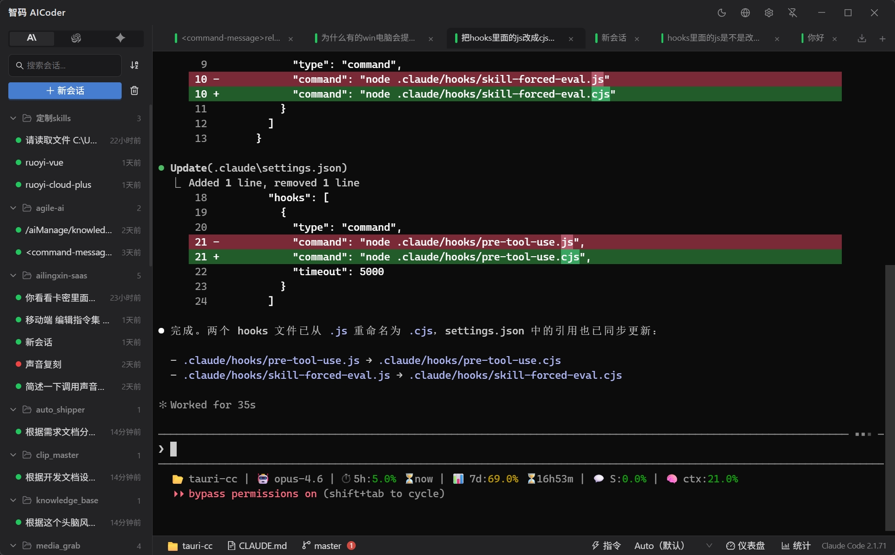
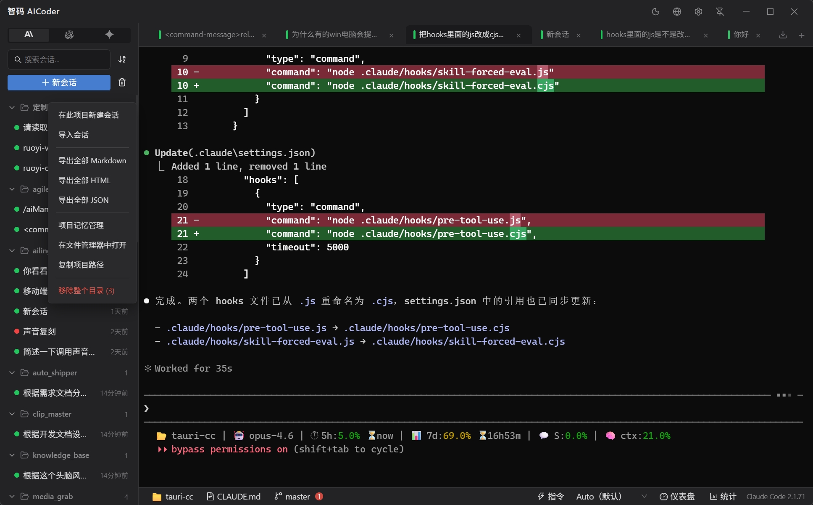
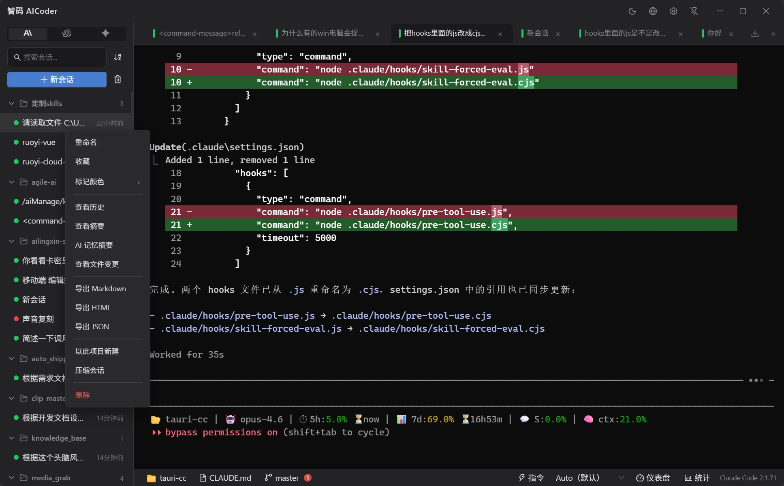
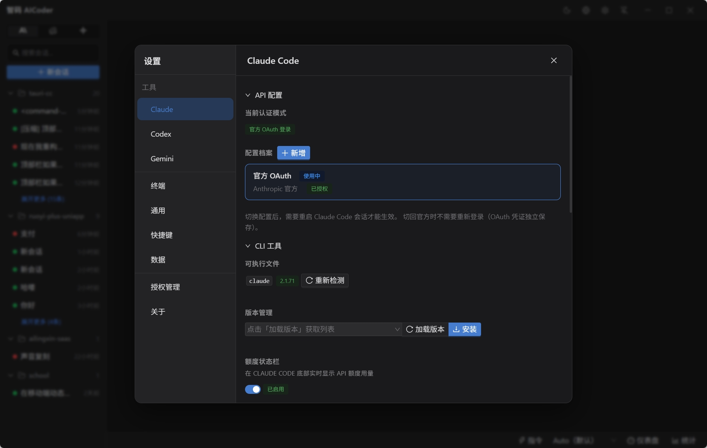
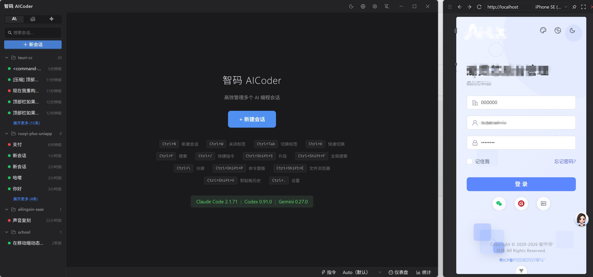

# 智码 AICoder

> 一站式 AI 编程助手管理平台 — 支持 Claude Code / Codex / Gemini CLI

## 简介

智码 AICoder 是一款轻量级桌面应用，为 AI CLI 编程工具打造统一管理平台。支持 **Claude Code**、**Codex CLI**、**Gemini CLI** 三大 AI 编程助手，提供可视化的会话管理、多标签终端、Token 统计和开发效率工具，让你在一个桌面应用中高效管理所有 AI 编程工作流。

## 应用预览

### 主界面 — 多项目会话管理 + 快捷键面板



### 多标签终端 — 代码 Diff 视图 + 多项目会话管理



### 项目右键菜单 — 导入导出 / 记忆管理 / 文件操作



### 状态栏 — Token 用量统计 + 会话耗时追踪



### 设置面板 — API 配置 / CLI 工具管理 / 版本切换



### 内置浏览器 — 分屏预览网页应用



## 核心功能

- **多工具统一管理** — 支持 Claude Code、Codex CLI、Gemini CLI，自动检测已安装工具和版本，一键切换
- **终端管理** — 内置 PTY 终端，支持多标签页并行会话，会话可弹出为独立窗口
- **会话管理** — 创建、切换、收藏会话，按项目自动分组，8 种颜色标记，模糊搜索秒找历史对话
- **多账号隔离** — 多实例完全独立（登录凭据/API Key/会话记录/配置），支持同时使用公司和个人账号
- **Claude 会话浏览** — 查看历史对话记录，支持搜索和导出（Markdown/HTML），自动生成会话摘要
- **Token 统计** — 实时追踪 API 用量（输入/输出/缓存分别统计），每日趋势图 + 月度总览 + 180 天热力图
- **代码片段** — 保存常用 Prompt 和代码模板，支持模板变量，一键插入终端
- **AI 记忆管理** — 支持多 AI 提供商的记忆生成和管理
- **快捷命令面板** — `Ctrl+K` 整合内置指令、项目命令、代码片段，智能排序
- **内置浏览器** — 分屏预览网页应用
- **文件浏览器** — 树形浏览项目文件，20+ 种文件类型图标
- **Git 面板** — 查看当前分支、提交日志、文件变更状态
- **API 配置管理** — 多 API Profile 切换，支持不同密钥和端点配置
- **MCP Server 管理** — 可视化管理 Model Context Protocol 服务器配置
- **CLAUDE.md 编辑器** — 项目级和全局 CLAUDE.md 在线编辑
- **深色/浅色主题** — 跟随系统或手动切换，护眼舒适
- **系统托盘** — 最小化到托盘，常驻后台
- **自动更新** — 内置 OTA 更新，新版本自动推送
- **零额外开销** — CLI 原生运行，不拦截/不修改/不转发 API 请求，费用与直接用终端完全一样

## 系统要求

- **操作系统**: Windows 10/11 (x64)、macOS (Apple Silicon / Intel)
- **运行时**: 无需额外安装（Windows WebView2 已内置于 Windows 10+）
- **磁盘**: ~10 MB 安装空间
- **前置**: 需已安装以下至少一个 AI CLI 工具：
  - [Claude Code](https://docs.anthropic.com/en/docs/claude-code)（Anthropic）
  - [Codex CLI](https://github.com/openai/codex)（OpenAI）
  - [Gemini CLI](https://github.com/google-gemini/gemini-cli)（Google）

## 下载安装

### 最新版本: v2.3.0

| 平台 | 下载链接 |
|------|---------|
| Windows x64 | [AICoder_2.3.0_x64-setup.exe](releases/v2.3.0/AICoder_2.3.0_x64-setup.exe) |
| macOS Apple Silicon | [AICoder_2.3.0_aarch64.dmg](releases/v2.3.0/AICoder_2.3.0_aarch64.dmg) |
| macOS Intel | [AICoder_2.3.0_x64.dmg](releases/v2.3.0/AICoder_2.3.0_x64.dmg) |

### 安装步骤

1. 下载上方安装包
2. 双击运行安装程序
3. 选择安装语言（中文/英文）
4. 按提示完成安装
5. 启动应用，开始使用

## 更新机制

应用内置自动更新功能：

- 启动后自动检查更新（首次延迟 5 秒，之后每 30 分钟检查一次）
- 发现新版本后，右上角浮动通知显示「有可用更新」
- 点击「立即更新」按钮，自动下载并安装
- 安装完成后自动重启应用

更新清单文件: [update.json](update.json)

## 版本历史

### v2.3.0 (2026-03-19)

- 新功能发布

### v2.2.1 (2026-03-18)

- 添加 Deep Link 协议支持（aicoder:// URL scheme）
- 替换 tauri-plugin-pty 为自定义 PTY 实现，修复资源泄漏
- 暂时禁用 HTTP API 中转站配置功能

### v2.2.0 (2026-03-17)

- 新增 AI 记忆管理系统（支持多 AI 提供商的记忆生成）
- 新增垃圾桶功能，实现会话软删除
- 新增会话压缩功能
- 新增侧边栏文件夹排序功能
- 新增工具版本批量更新功能
- 统一子进程命令创建和输出解码处理
- 优化 CLI 工具版本检测日志输出

### v2.1.0 (2026-03-17)

- 修复部分电脑窗口启动后不显示的问题
- 前端立即显示窗口，不再依赖设置加载完成
- CLI 工具检测（claude/codex/gemini --version）增加 5 秒超时，防止子进程挂起阻塞
- Rust 兜底改用 Windows 原生 ShowWindow API，绕过可能阻塞的事件循环
- 消除 Vite 动态导入警告（全部转为静态导入）
- 生产日志不再泄露授权服务器地址

### v2.0.0 (2026-03-15)

- 新增内置浏览器预览功能
- 新增文件浏览器功能
- 新增会话压缩功能
- 新增 Gemini API 配置面板（支持多配置档案和环境变量注入）
- 重构设置面板结构和 API 配置模块
- 修复会话标题格式和终端写入字符问题

### v1.2.1 (2026-03-14)

- 新增关闭窗口询问确认弹窗（最小化到托盘/退出程序，支持记住选择）
- 设置页关闭行为新增"每次询问"选项

### v1.2.0 (2026-03-14)

- 新增会话导出功能和消息归档机制（支持完整会话链追踪导出）
- 新增会话克隆功能（预设项目路径和 CLI 参数）
- 新增会话颜色标记和全局导入功能
- 新增禁用 npm 版安装提示功能
- 新增从默认 CLI 参数解析工具标志和值
- 优化多开实例锁机制和样式布局
- 优化系统命令执行和文件操作性能
- 更新 macOS PATH 环境变量获取策略

### v1.1.6 (2026-03-13)

- 新增会话 CLI 参数配置功能（自定义 Claude Code 启动参数）
- 新增终端图片粘贴预览和悬停放大功能
- 新增会话导出功能的元数据和内容清理
- 新增窗口置顶功能
- 修复时间戳格式化和路径检测逻辑
- 修复图片预览在退格和 Ctrl+C 操作后未关闭的问题

### v1.1.5 (2026-03-12)

- 修复 macOS PTY 终端 PATH 不完整（nvm/volta 安装的 CLI 工具找不到）
- PTY 终端使用用户默认 shell（zsh -l -i）而非硬编码 bash
- PTY 启动时注入增强 PATH 环境变量

### v1.1.4 (2026-03-12)

- 修复 macOS CLI 检测失败（重写 PATH 获取策略，支持 nvm/fnm/volta/mise/asdf 等）
- 修复 macOS 终端光标不可见
- 修复 About 页面浅色主题显示异常
- 修复新建会话标题被旧会话覆盖
- 修复多实例 MCP 配置不同步
- 修复 hasCompletedOnboarding 写入位置错误
- 新增 API 配置切换时环境变量冲突检测
- 优化设置弹窗堆叠（订阅/激活不再关闭设置）

### v1.1.3 (2026-03-12)

- 功能更新
- 新增双 GitHub CI 仓库支持（额度切换）

### v1.1.2 (2026-03-11)

- 启动时确保 hasCompletedOnboarding=true（跳过 Claude Code onboarding 交互）
- 打包产物文件名去掉中文前缀（统一为 AICoder_ 格式）

### v1.1.1 (2026-03-11)

- Rust 侧授权守门（过期状态下禁止创建会话/片段，前端无法绕过）
- HMAC-SHA256 缓存完整性校验（防篡改本地授权缓存文件）
- StatusLine 统计插件多实例隔离（支持 CLAUDE_CONFIG_DIR 环境变量）
- 可执行文件名从 tauri.exe 更名为 aicoder.exe

### v1.1.0 (2026-03-11)

- 多开实例配置隔离（每个实例独立 Claude/Codex 配置目录，支持多账号并行）
- 双击标题栏最大化/还原窗口
- 多开实例首次启动自动复制默认配置文件（解决 onboarding 问题）
- 支持自定义 shell 配置并添加 Windows PowerShell→CMD 回退机制
- 过滤非正式版本的 Codex 安装列表
- 为开发环境创建独立数据目录
- 添加窗口置顶功能

### v1.0.1 (2026-03-11)

- 修复 macOS GUI 应用找不到 npm/node 命令（PATH 环境变量补充）

### v1.0.0 (2026-03-11)

- 多提供商支持与命令优化

### v0.2.0 (2026-03-10)

- Bug 修复 + 性能优化

### v0.1.9 (2026-03-10)

- 修复右上角更新弹窗按钮无响应（改用 Modal.confirm 静态方法）
- CI 增加 macOS `.dmg` 和 Linux `.deb` 安装包下载

### v0.1.8 (2026-03-10)

- 修复 CI macOS updater 产物缺失（`--bundles dmg` → `--bundles app,dmg`）
- 优化 CI 推送顺序：Gitee 优先推送，GitHub 备份（`continue-on-error`）

### v0.1.7 (2026-03-10)

- 修复 CI 草稿 Release 权限问题（contents: read → write）

### v0.1.6 (2026-03-10)

- 修复 CI 草稿 Release 查询 404（改用 /releases 列表 API）
- 修复 Linux 编译 unused import 警告

### v0.1.5 (2026-03-10)

- CI update.json 支持全平台自动更新（Windows/macOS/Linux）
- 修复 Linux CI 签名失败（硬编码空密码）

### v0.1.4 (2026-03-10)

- 切换自动更新端点到 Gitee（解决中国大陆无法访问 GitHub raw URL）
- CI 构建后自动同步产物到 GitHub + Gitee 双仓库
- 修复更新弹窗无响应问题（z-index + 错误提示）

### v0.1.3 (2026-03-10)

- 活动热力图功能
- GitHub Actions CI 跨平台构建

### v0.1.2 (2026-03-09)

- 侧边栏重设计：按项目目录分组（替代原时间分组）
- 相对时间显示（刚刚/X分钟前/X小时前/X天前）
- 项目组折叠/展开，超过 3 条自动收起
- 收藏会话置顶独立分组
- 更新提示改为标题栏内嵌徽章

### v0.1.1 (2026-03-09)

- 优化更新提示 UI：从顶部横条改为右上角浮动通知
- 显示「有可用更新」文字，点击可直接升级
- 支持关闭通知稍后提醒
- 下载时显示进度条

### v0.1.0 (2026-03-09)

首个公开版本，包含以下功能：

- Claude Code 终端集成（PTY）
- 多会话标签页管理
- Claude 历史会话浏览和搜索
- 代码片段管理
- Token 消耗统计
- API Profile 多配置管理
- MCP Server 可视化管理
- CLAUDE.md 编辑器
- 深色/浅色主题
- 系统托盘
- 自动更新

## 项目结构

```
aicoder-release/
├── README.md           # 本文件
├── update.json         # 自动更新清单（Tauri Updater 读取）
├── .gitignore          # Git 忽略规则
└── releases/           # 版本发布目录
    └── v2.3.0/         # v2.3.0 版本
        ├── AICoder_2.3.0_x64-setup.exe           # Windows 安装包
        ├── AICoder_2.3.0_x64-setup.exe.sig       # Windows updater 签名
        ├── AICoder_2.3.0_aarch64.dmg             # macOS Apple Silicon
        ├── AICoder_aarch64.app.tar.gz            # macOS ARM updater 产物
        ├── AICoder_aarch64.app.tar.gz.sig        # macOS ARM updater 签名
        ├── AICoder_2.3.0_x64.dmg                 # macOS Intel
        ├── AICoder_x64.app.tar.gz               # macOS Intel updater 产物
        └── AICoder_x64.app.tar.gz.sig           # macOS Intel updater 签名
```

## 发布新版本流程

1. 在主项目中更新版本号（`tauri.conf.json` / `Cargo.toml` / `package.json`）
2. 打 Git Tag（`v*.*.*` 格式）并推送到 GitHub，CI 自动构建 Windows + macOS 安装包
3. 从 GitHub Release 下载产物，本地推送到本仓库并生成 `update.json`

## 许可证

Copyright (c) 2026 AgileFR. All rights reserved.
