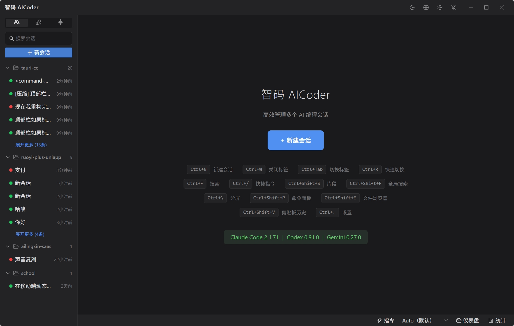
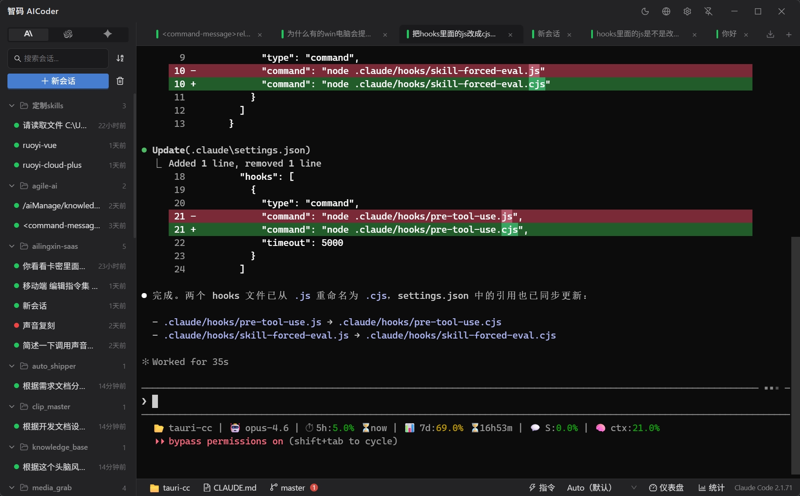
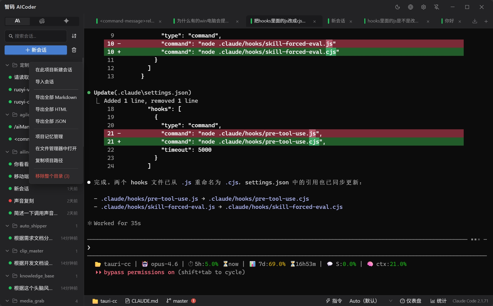
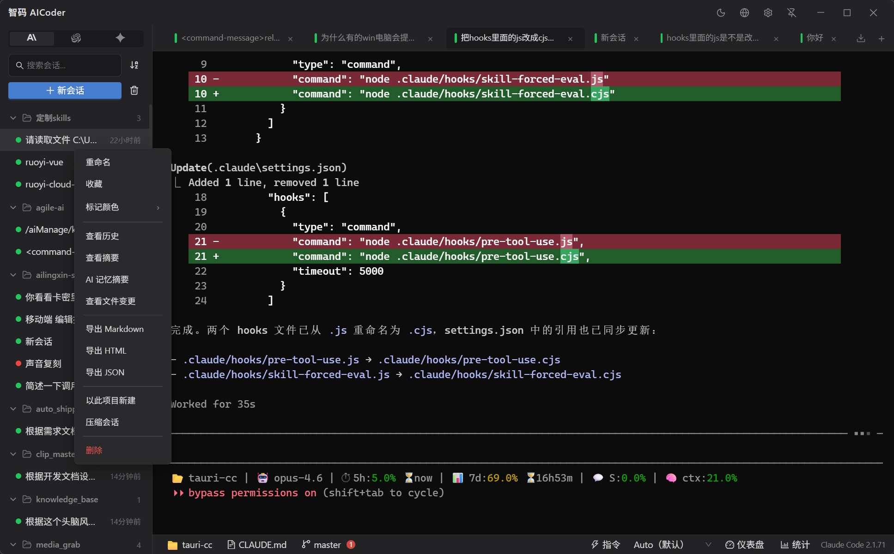
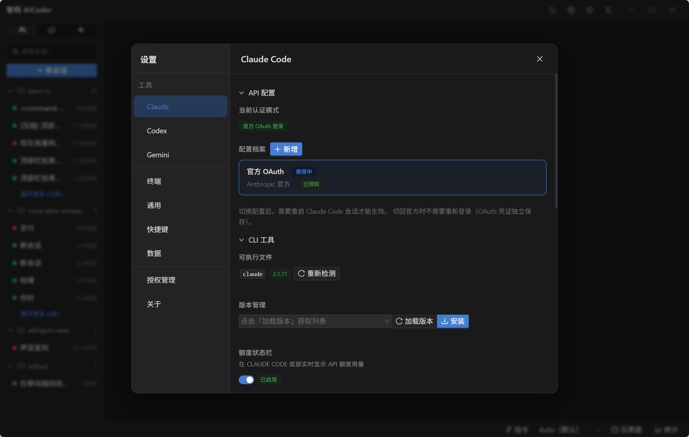
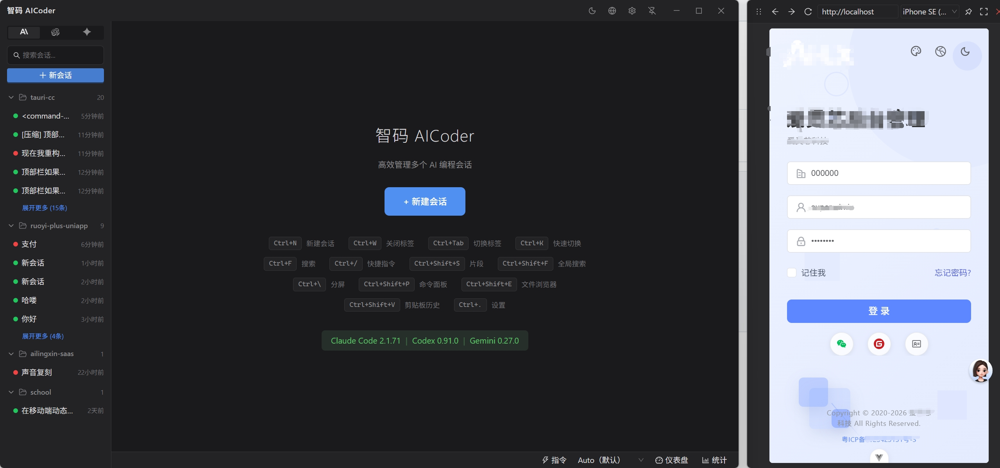

# 智码 AICoder

> 一站式 AI 编程助手管理平台 — 支持 Claude Code / Codex / Gemini CLI

## 简介

智码 AICoder 是一款轻量级桌面应用，为 AI CLI 编程工具打造统一管理平台。支持 **Claude Code**、**Codex CLI**、**Gemini CLI** 三大 AI 编程助手，提供可视化的会话管理、多标签终端、Token 统计和开发效率工具，让你在一个桌面应用中高效管理所有 AI 编程工作流。

## 应用预览

### 主界面 — 多项目会话管理 + 快捷键面板



### 多标签终端 — 代码 Diff 视图 + 多项目会话管理



### 项目右键菜单 — 导入导出 / 记忆管理 / 文件操作



### 状态栏 — Token 用量统计 + 会话耗时追踪



### 设置面板 — API 配置 / CLI 工具管理 / 版本切换



### 内置浏览器 — 分屏预览网页应用



## 核心功能

- **多工具统一管理** — 支持 Claude Code、Codex CLI、Gemini CLI，自动检测已安装工具和版本，一键切换
- **终端管理** — 内置 PTY 终端，支持多标签页并行会话，会话可弹出为独立窗口
- **会话管理** — 创建、切换、收藏会话，按项目自动分组，8 种颜色标记，模糊搜索秒找历史对话
- **多账号隔离** — 多实例完全独立（登录凭据/API Key/会话记录/配置），支持同时使用公司和个人账号
- **Claude 会话浏览** — 查看历史对话记录，支持搜索和导出（Markdown/HTML），自动生成会话摘要
- **Token 统计** — 实时追踪 API 用量（输入/输出/缓存分别统计），每日趋势图 + 月度总览 + 180 天热力图
- **代码片段** — 保存常用 Prompt 和代码模板，支持模板变量，一键插入终端
- **AI 记忆管理** — 支持多 AI 提供商的记忆生成和管理
- **快捷命令面板** — `Ctrl+K` 整合内置指令、项目命令、代码片段，智能排序
- **内置浏览器** — 分屏预览网页应用
- **文件浏览器** — 树形浏览项目文件，20+ 种文件类型图标
- **Git 面板** — 查看当前分支、提交日志、文件变更状态
- **API 配置管理** — 多 API Profile 切换，支持不同密钥和端点配置
- **MCP Server 管理** — 可视化管理 Model Context Protocol 服务器配置
- **CLAUDE.md 编辑器** — 项目级和全局 CLAUDE.md 在线编辑
- **深色/浅色主题** — 跟随系统或手动切换，护眼舒适
- **系统托盘** — 最小化到托盘，常驻后台
- **自动更新** — 内置 OTA 更新，新版本自动推送
- **零额外开销** — CLI 原生运行，不拦截/不修改/不转发 API 请求，费用与直接用终端完全一样

## 系统要求

- **操作系统**: Windows 10/11 (x64)、macOS (Apple Silicon / Intel)
- **运行时**: 无需额外安装（Windows WebView2 已内置于 Windows 10+）
- **磁盘**: ~10 MB 安装空间
- **前置**: 需已安装以下至少一个 AI CLI 工具：
  - [Claude Code](https://docs.anthropic.com/en/docs/claude-code)（Anthropic）
  - [Codex CLI](https://github.com/openai/codex)（OpenAI）
  - [Gemini CLI](https://github.com/google-gemini/gemini-cli)（Google）

## 下载安装

### 最新版本: v4.3.0

| 平台 | 下载链接 |
|------|---------|
| Windows x64 | [AICoder_4.3.0_x64-setup.exe](https://pub-9d9e6c0cb6934fb0a0c505e3c64f39b2.r2.dev/aicoder/releases/v4.3.0/AICoder_4.3.0_x64-setup.exe) |
| macOS Apple Silicon | [AICoder_4.3.0_aarch64.dmg](https://pub-9d9e6c0cb6934fb0a0c505e3c64f39b2.r2.dev/aicoder/releases/v4.3.0/AICoder_4.3.0_aarch64.dmg) |
| macOS Intel | [AICoder_4.3.0_x64.dmg](https://pub-9d9e6c0cb6934fb0a0c505e3c64f39b2.r2.dev/aicoder/releases/v4.3.0/AICoder_4.3.0_x64.dmg) |
| Linux Debian/Ubuntu | [AICoder_4.3.0_amd64.deb](https://pub-9d9e6c0cb6934fb0a0c505e3c64f39b2.r2.dev/aicoder/releases/v4.3.0/AICoder_4.3.0_amd64.deb) |
| Linux 通用 (AppImage) | [AICoder_4.3.0_amd64.AppImage](https://pub-9d9e6c0cb6934fb0a0c505e3c64f39b2.r2.dev/aicoder/releases/v4.3.0/AICoder_4.3.0_amd64.AppImage) |

### 移动端伴侣 · v0.5.0

> Android 侧载分发，需要在系统设置中允许「未知来源安装」。iOS 暂未发布。
> 移动端版本号与桌面端独立维护：移动端 v0.5.0。

| 平台 | 下载链接 | 用途 |
|------|---------|------|
| Android APK | [AICoder-mobile-v0.5.0.apk](https://pub-9d9e6c0cb6934fb0a0c505e3c64f39b2.r2.dev/aicoder-mobile/releases/mobile-v0.5.0/AICoder-mobile-v0.5.0.apk) | 用户直接安装 |
| Android AAB | [AICoder-mobile-v0.5.0.aab](https://pub-9d9e6c0cb6934fb0a0c505e3c64f39b2.r2.dev/aicoder-mobile/releases/mobile-v0.5.0/AICoder-mobile-v0.5.0.aab) | Google Play 上架用（暂存档） |

**🆕 v0.5.0 — 手机端可用性修复**：新建会话补 claude_session_id 根治「收不到消息/暂无历史」、默认带 --dangerously-skip-permissions、项目目录必填、永久授权(-1)显示「永久」、接收指示器回复完自动归位，详见 [移动端版本历史](#移动端版本历史)。

**🔐 签名提示**：v0.3.5 之前所有版本都是 CI 临时 debug 签名，与 v0.3.6+ 的稳定 release keystore 不一致——
**仍在 v0.1.0 ~ v0.3.5 的用户首次升级到 v0.4.0 必须卸载旧版重装一次**（一次性）；v0.3.6 及之后的用户可直接 OTA 覆盖升级，不受影响。

### 安装步骤

1. 下载上方安装包
2. 双击运行安装程序
3. 选择安装语言（中文/英文）
4. 按提示完成安装
5. 启动应用，开始使用

### macOS 安全提示

首次打开应用时，macOS 可能会提示：

> 未打开"智码 AICoder.app"，Apple 无法验证"智码 AICoder.app"是否包含可能危害 Mac 安全或泄漏隐私的恶意软件。

这是因为应用未经过 Apple 公证（Notarization），**并非恶意软件**。请执行以下命令解除限制：

```bash
sudo xattr -d com.apple.quarantine /Applications/智码\ AICoder.app
```

输入 Mac 登录密码后即可正常打开应用。

## 更新机制

应用内置自动更新功能：

- 启动后自动检查更新（首次延迟 5 秒，之后每 30 分钟检查一次）
- 发现新版本后，右上角浮动通知显示「有可用更新」
- 点击「立即更新」按钮，自动下载并安装
- 安装完成后自动重启应用

更新清单文件: [update.json](update.json)

## 移动端版本历史

### mobile-v0.5.0 (2026-06-05)

🐛 手机端可用性修复（守护进程上线后多项失效）：

- **🔑 新建会话收不到消息根治** — 新建会话补齐 `claude_session_id`（UUID v4）：缺它后端定位不到 JSONL，会话永远「暂无历史消息」收不到消息
- **🔓 默认带 --dangerously-skip-permissions** — 新建会话按工具填默认 CLI 参数，桌面起 Claude 不再卡每步权限弹窗
- **📁 项目目录改必填** — 新建会话强制选目录，避免后端因 project_path 为空返回空消息
- **♾️ 永久授权显示「永久」** — 授权天数 -1 正确显示「永久」（对齐桌面端），不再误显示「-1 天」或误弹续费提示
- **✨ 接收指示器自动归位** — 「接收中」改 idle 定时器状态机，PC 端回复完手机 2.5s 内停止闪烁（根治「已回复完仍一直转」）

### mobile-v0.4.0 (2026-05-11)

- **🔑 配置档案切换** — Chat 页顶部新增配置档案 chip，按当前工具列出所有 API Profile，一键切换（API Key 档案直接切，OAuth 档案提示需在桌面端切换）
- **⚡ 指令面板** — 输入框新增指令面板按钮，弹出底部面板，两个 Tab：
  - 「内置指令」：按当前会话的 provider 过滤的斜杠命令（claude / codex / gemini / opencode）
  - 「我的片段」：桌面端「代码片段」页创建的自定义片段
  - 点击条目把内容填入输入框
- **🧩 Provider 选择更智能** — 新建会话 FAB 的 provider 选项灰显未安装 / 未启用的工具，避免选了开不起来
- **✂️ placeholder 简化** — 输入框提示统一为「输入消息...」，小屏不再被换行撑乱
- **🔧 配合桌面 v3.5.7** — 桌面端给远程 prompt 加了 PTY 冷启动地板等待，移动端唤起桌面后立刻发消息不再被吞回车

### mobile-v0.3.6 (2026-05-08)

- **🔐 关键修复：固定生产签名 keystore（一次性破坏升级）**
  - **根因**：v0.3.5 之前 CI 仓库未配置 `ANDROID_KEYSTORE_BASE64` secret，每次构建用 GitHub runner 临时生成的 debug.keystore 签名 → 每个版本签名指纹都不同 → 用户每次升级都报"签名不一致"必须卸载重装
  - **修复**：本地生成稳定的生产 RSA 4096 keystore（SHA-256: `A5:B6:4A:F5:33:...:6B:02:BA`，有效期 100 年），配置到 CI 仓库 secrets，从 v0.3.6 开始所有版本都用同一 keystore 签名
  - **影响**：
    - 旧版（v0.1.0 ~ v0.3.5）用户**必须卸载后重装 v0.3.6**（一次性）
    - 装上 v0.3.6 后，未来所有版本（v0.3.7、v0.4.x...）都可直接 OTA 覆盖升级，不再卸载

- v0.3.5 中间版本因仍用 debug 签名实际未发布到下载源

### mobile-v0.3.4 (2026-05-08)

- **🎯 按 session_id 精确路由 PTY** — 配合桌面 v3.5.5 解决多会话发到错误会话的关键 bug
  - 之前用 `list.ids[0]` 选 PTY，多会话时新会话的 prompt 会被发到桌面侧的第一个会话
  - 现在按 URL 参数 `id`（桌面 Session.id）从 `list.items[]` 里精确匹配 `pty_id`
  - 老桌面端（无 `items` 字段）自动回退到 `ids[0]` 并 `console.warn` 提示用户升级
- **⚠️ 升级提醒** — 移动端单边升级解决不了根本问题，必须搭配桌面 v3.5.6+

### mobile-v0.3.3 (2026-05-07)

- **🔧 修复检查更新永远报「已是最新版本」的关键 bug**
  - 根因：`updateCheck.ts` 的 `parseSemver` 没剥 `mobile-` 前缀
  - `parseSemver("mobile-v0.3.2")` 返回 null → `compareSemver` 视为同版本 → UI 误报「已是最新」
  - 修复：先剥 `mobile-v` / `v` 前缀再做正则匹配
- **📱 老用户影响** — v0.3.1 / v0.3.2 用户**必须从下载页手动升级到 v0.3.3 一次**，
  之后 App 内自动 / 手动检查更新都能正常工作

### mobile-v0.3.2 (2026-05-07)

- **🔄 刷新授权状态 UX 重做** — 按钮加 loading state（图标旋转 + 文字「正在刷新…」）
- **✅ 反馈到位** — 调用成功 alert「已刷新：当前状态 已激活/试用中/已过期」；失败 alert 错误原因
- **🔧 内部** — `useMobileLicense.refresh` 改为返回新状态 / 抛错；自动 30min 轮询失败仍静默不打扰

### mobile-v0.3.1 (2026-05-07)

- **🔧 修复 Cleartext Traffic 关键 bug** — Android Release 包 `usesCleartextTraffic="false"`
  导致 fetch 直接被系统拦截，浏览器能打开但 App 内 AddServerDialog 添加桌面失败
- **🌐 全场景 http:// 支持** — IPv4 / IPv6 字面量 / 域名形式的公网地址都能正常配对
- **📱 用户影响** — v0.3.0 用户必须升级才能添加 http:// 桌面端，已配对的会话不受影响

### mobile-v0.3.0 (2026-05-07)

- **🔔 启动检查新版本** — 启动时静默检查 R2 `mobile-versions.json`，发现新版弹 Modal 提示去下载页（24h 节流）
- **🔍 手动检查更新** — 「我的」页加「检查更新」按钮，可主动触发
- **🌐 网络错误中文化** — 按 baseUrl 形式给差异化中文提示（HTTP/HTTPS/局域网 IP/IPv6）
- **🆕 IPv6 / IPv4 字面量** — 公网地址输入框支持 `[::1]:7420` / `[2408::1]:7420` / `192.168.x.x` 直接填入
- **🎨 添加桌面体验优化** — AddServerDialog 配对流程更顺滑

### mobile-v0.2.0 (2026-05-07)

- **📎 附件上传** — 输入框左侧新增 `📎` 按钮，支持图片 / PDF / 文档多选；图片自动压缩（拍照 4-12MB → ~300KB）；chip 缩略图点击 Modal 看原图
- **📋 粘贴图片** — `textarea` 监听 paste 事件，QQ/微信截图后 `Ctrl+V` 直接粘贴到对话
- **🏷 附件 chip 渲染** — 用户消息气泡里把 `@<path>` 渲染成 `[🖼 photo.jpg]`，替代裸路径
- **🕖 消息时间戳** — 用户气泡 + AI 气泡显示发送/接收时间（同天 `HH:mm`，跨天 `MM-dd HH:mm`）
- **📦 debug/release 并存** — 调试包独立 `applicationId` (`.debug` 后缀)，可与生产包同时安装互不覆盖
- **🔔 PC 端实时提示** — 手机发附件桌面右下角弹「📎 收到 photo.jpg [打开] [定位]」
- **🧹 自动清理** — `mobile-uploads/` 下 7 天前文件启动时自动清理
- **🎨 placeholder 缩短** — 输入框提示从「输入消息... (Ctrl+Enter 发送 · 可粘贴图片)」改为「输入消息...」，避免小屏被换行
- **🛠️ CI 修复** — `parseAttachments` re-export 用相对路径替代 `@/` 别名（修 v0.2.0 首次构建失败）

### mobile-v0.1.0 (2026-05-06)

- **🚀 移动端伴侣首发** — Tauri Mobile Android，与桌面端 v3.5.1 同期发布
- **📱 4 屏完整体验** — 会话列表 + 实时对话 + 设备管理 + 个人中心
- **🎙️ 按住说话** — 录音上传桌面 ASR 通道识别，松开自动填入输入框
- **🔐 设备配对** — PIN 兑换长期 token + 二维码扫码配对
- **🛡️ 安全收口** — TLS/WSS 强制 + 审计日志 + 熔断 + 紧急下线
- **🔍 全局搜索** — 标题 / 项目路径 / 消息内容三合一

---

## 版本历史

### v4.3.0 (2026-06-09)

- 🐛 修复扫描器生成的 Java 启动命令在中文路径下乱码/找不到类（BOM + argfile 编码）
- 🐛 修复输入法候选窗在终端输入时闪烁
- 🚀 远程会话跨电脑统一（远程 JSONL 对账补建）
- 🚀 工作区 diff/编辑器补齐 Java/SQL 等语言高亮
- 🚀 Tab 数量默认不限制 + 内存触发阈值调整
- 🐛 修复多实例内置浏览器串窗
- 🐛 修复主窗口大内容渲染卡死（markdown/历史浮层/diff 降级）
- 🚀 扫描器支持 CMakePresets 双层布局

### v4.2.1 (2026-06-05)

🔧 安装体验 + 多会话恢复修复：

- **🐛 根治安装/卸载卡在「停止守护进程」** — 安装器改为优雅停止守护进程：先停 watchdog 并轮询确认其真正退出（每 200ms 补刀、最多约 3 秒），再依次清理主进程 / MCP / pty-host 各一次，消除安装与卸载时卡在「停止守护进程」约 10 秒的体验问题；若无守护进程在运行则立即跳过。
- **🐛 修复多个 Codex 会话恢复后内容张冠李戴** — 同一项目开多个 Codex 会话时，升级重启自动恢复后可能出现「会话名正确、点进去内容却是别的会话」。根因是恢复时会话指针被错绑到相邻会话的记录文件；现恢复已有会话不再重新猜测文件，根治串号（你的真实对话从未丢失，仅指针指错）。

### v4.2.0 (2026-06-05)

🚀 工作区 Git 增强 + 标题栏开关：

- **🗂️ 工作区目录树右键菜单** — 工作区提交面板改为 IDEA 风格目录树，右键支持暂存/取消暂存/暂存整个目录、打开 Diff、在编辑器/IDEA/系统程序打开、复制相对·绝对路径·文件名、在资源管理器显示
- **🗑️ Git 丢弃改动** — 新增「丢弃改动…」：把选中文件还原到上次提交（未跟踪文件直接删除），带二次确认
- **🤖 文件级 AI 操作** — 右键可把文件 @引用 发送到主窗口 AI 终端、复制 @引用、让 AI 解释/审查此文件
- **🚫 一键加入 .gitignore** — 右键未跟踪文件直接写入 .gitignore
- **🔗 标题栏官网链接显隐开关** — 设置→通用新增开关，关掉后标题栏只保留应用名，适合录屏/演示
- **⚡ 面板打开无延迟** — 遮罩面板打开的瞬间同步隐藏子 webview，消除「设置先显示、webview 后隐藏」的可见延迟

### v4.1.0 (2026-06-04)

🚀 模型切换 + 多平台模型适配 + 终端体验：

- **🚀 底部状态栏一键切换模型** — 点状态栏模型名即可切换：Claude 即时热切当前会话，Codex/Gemini/OpenCode 重启会话生效；下拉显示当前 API 配置（Profile）的真实模型（小米 MiMo / GLM / DeepSeek 等），不再误显示 Anthropic 机型
- **🚀 Codex 第三方模型上下文窗口自动写入** — 切换配置时按模型自动写入真实上下文窗口（MiMo 1M、GLM 200K、DeepSeek 128K 等），避免提前压缩、用满超长上下文
- **🚀 Claude 第三方端点别名映射** — 接小米/GLM/Kimi 等第三方端点时，`/model` 选 Opus/Sonnet 也能正确跑实际模型，不再报错
- **🚀 添加账号登录终端支持点击聚焦 + 右键粘贴** — 贴 OAuth code 更顺手
- **🚀 提交弹窗可点文件查看 diff（HEAD ↔ 工作区）+ 主题感知**
- **🛡️ 下一步建议发送前自动脱敏** — 密钥类 + PII 强制常开；建议显示 30 秒后半透明、hover 恢复
- **⚡ 终端内存优化** — scrollback 默认 10000→5000，pty-host 常驻内存减半；远程 PTY 改走统一后端抽象
- **🐛 修复 Gemini 会话记录不上 / 每次需手动 resume**
- **🐛 修复历史查看器/导出把工具结果误标为用户消息**
- **🐛 侧边栏 AICoder 助手目录稳定置顶；关闭会话清理通知时间戳累积**

### v4.0.4 (2026-06-03)

🔧 修复 MCP 接入 + 内置浏览器开发者工具：

- **🐛 修复「一键接入 Claude Code」接入不生效** — 生产环境（安装版）下一键接入会把配置写到错误的文件位置，导致设置页显示「已接入」但 Claude Code 实际读不到 aicoder MCP。现按 Claude Code CLI 实际读取规则统一配置路径，接入后终端 `/mcp` 即可看到 aicoder（修复后需重新点一次「一键接入」写到正确位置）
- **🚀 内置浏览器支持开发者工具** — 生产环境的内置浏览器（含 AI 自动打开的预览面板）现可用 F12 / 右键「检查」打开开发者工具调试网页；应用主界面本身仍不暴露，安全无虞
- **🐛 修复 macOS 旧版系统终端路径链接崩溃** — 旧版 macOS 系统 WebView 不支持某正则语法，导致终端里的文件路径点击功能整体失效，现改为等价写法兼容

### v4.0.3 (2026-06-03)

🌐 外部浏览器窗 + 嵌入面板会话归属 + 本地优先恢复：

- **🚀 外部站点独立浏览器窗** — 工具栏移到外层（宿主窗 React），网页作为子 webview 直连，不再被网页固定顶栏遮挡；内置浏览器面板按会话归属，切换会话自动隐藏/恢复，关闭会话自动回收子窗
- **🏷️ 标题栏版本号胶囊** — 新增版本号显示，点击一键检测更新
- **🏠 关闭重开只恢复本地会话** — 重开软件不再自动连接/恢复远程（服务器）会话，只恢复本地；远程会话的 tmux 仍在服务器运行，需要时手动切到对应远程工作区即可继续
- **🐛 修复目录被误当文件打开** — 提交面板 / Diff 视图中，未跟踪目录或嵌套 Git 仓库不再被当成文件打开而报「拒绝访问」，改为友好提示（勾选复选框仍可整目录提交）

### v4.0.2 (2026-06-02)

🔧 修复安装器升级失败：

- **🐛 修复升级安装时报「无法写入 aicoder-pty-host.exe」装不上的问题** — PTY 主机是游离进程（与守护进程解耦以便会话续传），旧安装脚本「单次结束进程 + 固定等待 1 秒」挡不住守护进程的秒级重启竞态，导致升级覆盖文件时 PTY 主机仍被占用。现改为「循环结束进程树 + 轮询确认已退出」，并补充结束 MCP sidecar 进程，根治升级装不上。

### v4.0.1 (2026-06-02)

🔀 IDEA 风格 Git 推送弹窗 + diff 高亮：

- **🚀 新增 IDEA 风格 Git 推送弹窗** — `Ctrl+Shift+K` 打开、`Alt+K` 一键推送；支持多远端勾选（如 github + gitee 同时推），左侧待推送提交列表 + 路由行，右侧变更文件树
- **🔍 推送弹窗内点击文件查看改动 diff** — 远端版 ↔ 本地 HEAD 并排比对，带代码语法高亮
- **🎨 修复 diff 比对视图缺少语法高亮** — 与文件编辑器一致的着色（暗/亮主题分别适配）
- **⌨️ Git 提交/推送快捷键拆分** — `Ctrl+K` 提交、`Ctrl+Shift+K` 推送，主窗口与工作区一致

### v4.0.0 (2026-06-02)

🚀 内置浏览器升级为 AI 自动化面板 + 多项效率与稳定性增强：

- **🌐 内置浏览器升级为 AI 可驱动的自动化面板** — 终端 AI 经 MCP 完整操作内置浏览器做网页自动化/测试：18 个工具覆盖导航 / 点击 / 输入 / 等待 / 悬停 / 下拉 / 上传 / 下载 / cookie / localStorage / 结构化数据获取 / 表格 / 接口 mock / 录制回放 / 断言 / iframe / 元素截图；嵌入式三态面板贴主窗右上角不挡提问，登录态持久 + 可跨窗复用
- **📑 标签数量上限 + 内存压力自动关闭** — 标签超上限或内存吃紧时，自动关掉最久未活跃的会话
- **💡 下一步建议** — 会话回答完毕后用独立模型推荐接下来可问的提示词，点击即填入
- **🖥️ VT100 虚拟屏幕快照恢复终端** — 根治重启后差分 TUI（Claude / Codex）重画错位
- **🔗 跨实例会话标识符续聊** — 复制会话标识符到另一实例（dev↔prod），经 MCP 续聊
- **🐛 稳定性修复** — 远程控制下终端 IME 一字变两字、会话时间排序跳变、托盘交互等

### v3.9.3 (2026-05-30)

内存治理 + 终端稳定性 + 体验优化：

- **🧠 修复提交内存满载导致界面崩溃重启** — 长时间使用后，后端 RPC 输出队列无上限堆积、已退出会话残留的进程树不回收，导致系统提交内存（commit）耗尽、WebView 渲染进程被系统杀死。现加每会话 8 MiB 队列上限（超限丢最旧、保最新屏）+ pty-host 自动回收死会话（关闭 JobObject 清掉残留的 node / MCP server 进程树），从根上消除"越用越占内存直到崩溃重启"。
- **📊 新增状态栏内存指示器** — 实时显示提交内存余量，可一键管理空闲会话
- **🐛 终端稳定性** — 修复异常关闭恢复后终端底部 UI 重影、输入时窗口轻微偏移、attach 重连后终端尺寸错位
- **🔀 会话历史读取统一** — 跨 Claude / Codex / Gemini / OpenCode 收敛到统一 helper
- **⚡ 修复主界面卡顿** — Git / 文件命令下放 blocking 线程池
- **🎯 侧边栏切换收藏后视线跟随** — 滚出可视区自动滚回保持可见
- **🔔 "恢复上次会话"提示弹窗下移** — 不再遮挡顶部标题栏

### v3.9.2 (2026-05-29)

修复 v3.9.1 子窗口样式回归：

- **🐛 修复工作区 / 会话 / 预览 / 语音等独立窗口标题栏样式崩坏** — v3.9.1 路由级懒加载拆分后，全局基础样式（App.css / variables.css）未被这些懒加载子窗口加载，导致标题栏按钮、标签页关闭按钮等错位挤压。现已将全局基础样式提到统一入口，所有窗口共用。主窗口不受影响。

### v3.9.1 (2026-05-29)

MCP 对外服务 + Claude Opus 4.8 + 本地 LLM + 会话恢复增强 + 亮色主题深度适配：

- **🔌 AICoder 对外 MCP 服务** — 6 家 AI 客户端（Claude Code / Codex / Cursor / Cline / Zed / OpenCode）一键接入 AICoder 数据（会话 / 代码片段 / Token 统计 / API Profile / 项目记忆）
- **🤖 支持 Claude Opus 4.8 模型**
- **🦙 Codex 本地 LLM 后端** — 接入 Ollama / vLLM / LM Studio 本地模型
- **🔄 冷启动自动恢复上次会话** — 重启后逐个前台恢复上次打开的标签
- **🛡️ PTY 会话恢复大幅增强** — 重启 / 死机后自动重连、启动重试、终端不再渲染错位
- **😴 长任务运行期间阻止系统睡眠**（responding 状态绑定 wake lock）
- **🔗 终端路径链接** — 点击开文件 / Ctrl+点击开目录
- **⌨️ IDEA 风格快捷键** — Ctrl+K / Ctrl+Shift+K
- **🏷️ 标签栏显示会话序号** + 总数下拉切换；终端历史回滚扩到 10000 行
- **🎨 亮色主题深度适配** — 引入语义色 token 体系，消除多处黑斑
- **🐛 修复 macOS Command+Q 被误判重启**；MCP 能力清单改居中弹窗；App 路由级懒加载加快冷启动

### v3.8.0 (2026-05-27)

全新「远程 SSH 工作区」体系 + 工作区编辑器 + 大量 Provider 远程化：

- **🌐 远程 SSH 工作区** — 连接远程主机，在远端直接运行 Claude / Codex / Gemini / OpenCode，API Profile / MCP / Hooks 全部按工作区隔离；内置 SSH 连接池、远程 PTY、known_hosts 管理
- **🖥️ 远程主机管理面板** — 一键安装 Node / CLI（实时 SSH 安装日志）、远程目录浏览、远程 Git 操作
- **🗂️ 工作区编辑器** — 文件树右键菜单、代码大纲、Java / XML 语法高亮（One Dark 主题）、横向滚动
- **💻 终端增强** — 路径可点击跳转、远端 tmux 鼠标滚轮翻历史、修复 Claude /config 等 TUI 标签切换不响应
- **🔄 自动更新改为后台静默下载** — 下载完成后由用户主动重启，不打断当前工作
- **🧾 订阅页重做** — 日均成本 / 节省比实算、推荐档位、付费授权与设备绑定条款
- **☁️ WebDAV 同步支持跳过自签名证书校验** — 适配飞牛 NAS 等自签名证书环境
- **🐛 修复中文输入法候选窗飘移与重复输入；托盘「重启应用」保留会话标签**

### v3.7.5 (2026-05-24)

A-Enhanced 崩溃自愈链路 + 多实例隔离 + NSIS 升级护盾 + UI 体验改进：

- **WebView2 渲染崩溃强制让 watchdog 接管重启** — DiagnosticState 加滑动窗口风暴计数 / reload deadline + monotonic / unrecoverable 锁；用户被迫关闭黑屏窗口不再被误判为正常退出
- **power_monitor 监听 Windows WM_POWERBROADCAST** — 给 stale_heartbeat 加唤醒 30s grace，消除 sleep/wake 后立即关窗的误判
- **NSIS 安装前强杀整棵守护进程树**（watchdog + main + pty-host）— 解决升级时三个 exe 任一被锁导致「无法写入」
- **TUI provider detect 兜底 v3.7.0~v3.7.2 临时 UUID 残留** — codex/opencode/gemini 老会话 DB 里的临时 UUID 不在文件系统时自动覆盖为真实 cli session id
- **项目任务扫描去重** — 识别父 pom 的 `<modules>` 声明跳过重复扫描子模块；面板新增「清空全部任务」+ 右键菜单
- **清空 PTY 输入框支持多行 + Ctrl+L 快捷键** — `` + 200×Backspace 跨行兜底，覆盖 Ink TUI 多行输入
- **tab 重启菜单** — sessionId 不变重 spawn PTY，跳过 responding 确认弹窗
- **内存压力 toast 改造** — 20s 自动隐藏 + 避让右下角 FloatButton
- **4 个 Provider API config 面板表单聚焦统一** — 打开编辑表单时自动 focus 名称输入框

### v3.7.2 (2026-05-24)

v3.7.0 守护进程方案的延续修复 + 侧边栏交互优化：

- **守护进程模式下扫描任务启动报「pty id 0 not found」修复** — v3.7.0 把 PTY 拆出独立 pty-host 进程后，project_task service 仍直连主进程 PtyManager 而非 RpcBackend，导致 spawn 出的 pid 在 pty-host 找不到 → 连续 10 次读取错误后断开。改为走 `Arc<dyn PtyBackend>` trait，与普通终端共用同一条 PTY 路径
- **侧边栏目录单击体验优化** — 单击目录 = 折叠/展开会话列表（等同左侧 chevron），双击 = 打开工作区窗口；250ms 延迟避免双击触发先折叠又展开的视觉抖动

### v3.7.1 (2026-05-24)

v3.7.0 守护进程方案的紧急修复 — 3 个会阻塞使用的关键问题：

- **侧边栏目录点击扫描白屏修复** — TaskScanDialog 的 Zustand selector 每次渲染都 `return new Set(...)`，在 React 19 `useSyncExternalStore` 下进入快照死循环（React #185 Maximum update depth exceeded）；改为 selector 只取 store 内稳定数组引用，`new Set` 构造移到 `useMemo`
- **多实例 / dev + prod 并存修复** — pty-host named pipe 端点名从固定 `\\.\pipe\pty-host-poc` 改为按 instance id 隔离（`\\.\pipe\aicoder-pty-host-<id>`），watchdog 用自身 PID 生成 id，通过 env `AICODER_PTY_HOST_ENDPOINT_ID` 注入给 pty-host + main，互不抢 pipe；shutdown flag 路径同步按 id 隔离
- **`cargo tauri dev` 启动修复** — debug build 永远跳过 self-respawn via watchdog，仅 release build 启用守护进程接管；另加 `AICODER_NO_WATCHDOG=1` 应急关闭开关

### v3.7.0 (2026-05-23)

守护进程方案 — 主进程崩溃自动重启 + 会话自动恢复 + CLI 输出不中断：

- **守护进程架构（A-Enhanced）** — 引入 watchdog + pty-host 双 sidecar 进程：watchdog 监控主进程崩溃自动重启；pty-host 独立持有 PTY master，CLI 子进程不受主进程崩溃影响，继续运行
- **会话自动恢复** — 主进程崩溃 / 用户结束进程后，watchdog 自动重启主进程，所有活跃会话标签自动恢复，CLI 输出继续流式刷新（token 不浪费、对话不中断）
- **MessagePack RPC + 环形缓冲** — 前后端通过 named pipe / UDS + MessagePack 通信，每会话 2 MiB 环形缓冲保证重连无缝接续历史输出
- **AICODER_SUPERVISED 防 fork bomb 守卫** — 自重生路径加 env 守卫；watchdog 退出时主动清理 pty-host 子进程，避免僵尸进程
- **静默后台运行** — sidecar binary 用 GUI subsystem + CREATE_NO_WINDOW 标志，无任何命令行黑窗
- **NSIS 安装包默认携带守护进程** — 安装即启用 A-Enhanced 架构，无需用户额外配置

### v3.6.3 (2026-05-19)

体验完善 + 多项关键修复：

- **空闲会话清理面板** — 内存紧张时弹 notification 提供「管理空闲会话」按钮，列出所有非响应中的会话，闲置 ≥30 分钟默认勾选；勾选确认后批量关闭释放内存。responding 中的会话**绝对不显示**，关闭瞬间二次校验防误关
- **新建会话最近项目体验升级** — 加搜索框，输入时模糊匹配末两段路径并展开到 12 个；同名末段（如 `qt-app`）显示父目录前缀（`frameworks/qt-app`）区分；模板新增「用工作站」一键触发 ai-workstation MCP
- **API Profile 跨实例明文分享协议** — 单条 `ai.profile` / 多条 `ai.profile.bundle` envelope，跨同级软件互通；OAuth 类型档案后端强制跳过（凭证绑设备）；接入 4 个 Provider 配置面板
- **多个交互 bug 修复** — 空闲清理面板勾选反复回弹（每秒 tick 把用户取消的又自动加回）、连续关多 tab 时 activeTabId 残留幽灵（doCloseTab 闭包陷阱）、antd v6 Tooltip/Popover deprecation 迁移到 `styles.root/container`、静默 Windows PTY kill 已退出进程的 `os error 87` 无害报错

### v3.6.2 (2026-05-16)

WebView2 崩溃自愈 + 内存预防 + 多项关键修复：

- **WebView2 崩溃自动 reload** — 系统内存压力或其他原因导致 WebView2 渲染进程崩溃时，Rust 主进程监听 `ProcessFailed` 事件自动 reload，PTY 继续存活；前端重连后通过 `pty_list_active` + `attach()` 接管幸存终端，用户的 Claude / Codex / Gemini 对话状态零损失
- **commit-aware 内存预防** — 直接读 `GlobalMemoryStatusEx.ullAvailPageFile`（任务管理器同款指标），5 秒采样，commit 配额低于 30% 时自动降级 WebView2 内存模式；低于 15%/10% 时弹窗告警（双重判定：比例 + 绝对值 < 800MB 才报，大内存机不误报）
- **页面文件禁用提示** — 启动时检测系统页面文件被禁用一次性提示用户启用，避免低内存触发 0xc000012d 崩溃
- **修复新建空会话重开误绑** — 新建会话后秒关再从侧边栏重开时，detectActiveSession 会错误绑定上一次会话的 rollout（用户看到上一次对话的内容）。修复方案：双重过滤（since_ms ≥ session.created_at + occupiedIds 排除已归属会话）
- **修复 ~/.claude.json 写入擦掉 MCP/oauthAccount** — 历史 bug：4 处入口（ensure_onboarding_completed / ensure_claude_project_trusted / sync_claude_json_account_email / clear_claude_json_account_identity）用 `unwrap_or_else(|_| {})` 在 JSON 解析失败时静默替换为空对象，写回去就把整段 mcpServers/projects 擦了；改为解析失败立即返回 Err 不写入。`json_utils::write_json_file` 升级为「自动备份 + 原子 rename」三重保护，从根上解决 MCP Server 配置丢失问题

### v3.6.1 (2026-05-14)

侧边栏 UX 改进 + 模型选择尊重 + 自定义端点文案：

- **侧边栏多选删除** — Ctrl/Shift+Click 选中多条会话，右键弹「删除选中 N 条」批删
- **文件夹规则批删** — 右键文件夹动态显示「删除 30 天未活动 / 删除未收藏 / 删除已关闭」（条数为 0 不显示）
- **各 Provider 目录 chevron 一致** — Codex / Gemini / OpenCode 等少量会话文件夹也有 hover 切换器
- **激活会话强制可见** — 折叠态下保证当前选中 + 已打开标签页的会话不被收起
- **Claude 模型选择** — 新建对话框显式选的模型不再被活跃 API Profile 静默覆盖
- **自定义端点去后缀** — 4 个 Provider 面板的「自定义端点」选项去掉 `(OpenAI 兼容)` 后缀，避免误导 Claude / Gemini 用户
- **适配 Codex 0.124** — `codex_hooks` feature flag 改名为 `hooks`

### v3.6.0 (2026-05-14)

本次更新带来更清晰的产品体验：

- **新增首次启动使用说明** — 帮你快速了解软件定位与使用方式
- **设置-关于页新增产品说明区域** — 随时查看产品边界与商标信息
- **Provider 选项命名优化** — 措辞更直观清晰
- **终端性能提升** — TUI 会话消息加载更快、会话标题显示更稳定
- **无感升级** — 旧版配置自动适配新结构,本地数据无需手动操作

## 项目结构

```
aicoder-release/
├── README.md           # 本文件
├── update.json         # 桌面端自动更新清单（Tauri Updater 读取）
├── .gitignore          # Git 忽略规则
├── releases/           # 桌面端版本（最近版本：v4.2.1 / v4.2.0 / v4.1.0）
│   └── vX.Y.Z/         # 每版含 Win exe + macOS dmg/app.tar.gz + Linux deb/AppImage + 各自 .sig 签名
└── releases-mobile/    # 移动端伴侣 Android APK + AAB（独立版本号，仅保留最近版本）
    └── mobile-vX.Y.Z/  # 每版含 universal-release APK + AAB
```

## 发布新版本流程

1. 在主项目中更新版本号（`tauri.conf.json` / `Cargo.toml` / `package.json`）
2. 打 Git Tag（`v*.*.*` 格式）并推送到 GitHub，CI 自动构建 Windows + macOS 安装包
3. 从 GitHub Release 下载产物，本地推送到本仓库并生成 `update.json`

## 许可证

Copyright (c) 2026 AgileFR. All rights reserved.

